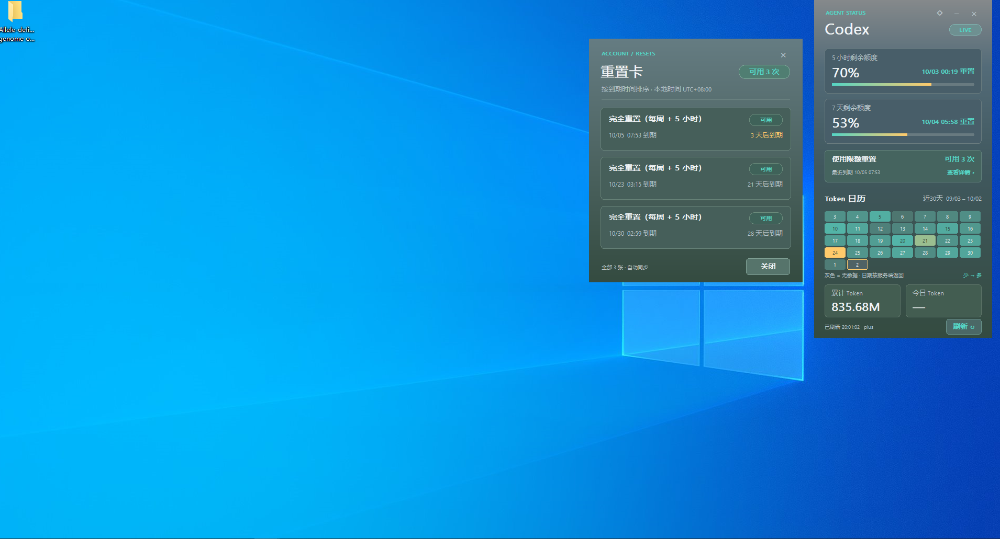

# Codex Meter

[简体中文](README.md) | [English](README_EN.md)

Windows 10/11 x64 原生 Rust 额度悬浮卡片。使用 Win32 + GDI，无 WebView、Electron、浏览器或 Node 运行时。

## 使用截图



主窗口与重置卡详情的实际使用截图。截图中的额度、Token 和日期仅代表拍摄时的账户状态；今日 Token 的 `—` 表示服务端尚未返回对应日期的数据。

## 下载与快速安装

1. 打开 [Releases 下载页](https://github.com/zhangyixing3/codex-meter/releases/latest)，下载 `CodexMeter-Windows-x64.zip`（不要选择 Source code）。
2. 解压 ZIP 到一个文件夹；不要直接在压缩包内运行安装脚本。
3. 确保已安装 Codex 桌面版或 Codex CLI，并登录你的 ChatGPT 账户。
4. 便携使用：双击 `CodexMeter.exe`。安装使用：双击 `Install.cmd`，会安装到 `%LOCALAPPDATA%\Programs\CodexMeter` 并创建桌面和开始菜单快捷方式，无需管理员权限。
5. 首次启动等待数据加载；之后每 5 分钟自动更新，也可以手动点击刷新。

运行发行包不需要安装 Rust。更新时先从托盘菜单退出旧版，再解压新版并重新运行 `Install.cmd`。卸载前退出软件，在解压的发行包中运行 `Uninstall.cmd`；缓存默认保留。

安装后也可打开 `%LOCALAPPDATA%\Programs\CodexMeter`，运行其中的 `Uninstall.cmd` 卸载。

## 常见问题

- **今日 Token 显示 `—`**：服务端还没有返回与 Windows 本地今天日期匹配的统计，或当前 Codex 版本不支持该接口。`—` 表示未知，不表示使用量为零。
- **刷新失败 / STALE**：点击底部状态查看原因，检查网络、Codex 登录状态和版本。失败时保留上次数据，并显示缓存状态。
- **找不到 Codex**：按下方说明配置 `codex_path`，选择真正的 `codex.exe`，而不是 `.cmd` 启动脚本。
- **窗口关闭后仍在运行**：关闭按钮会收起到系统托盘；从托盘右键菜单选择“退出”才会完全退出。
- **重置卡能使用吗**：目前只展示卡片信息；实际使用请在官方 Codex 界面操作。

## 许可证

本项目采用 [MIT 许可证](LICENSE)，允许使用、修改和分发；分发时须保留许可证与版权声明。

## 使用

下载/打开 `dist/CodexMeter/CodexMeter.exe` 即可运行。已经安装并登录 Codex 桌面版或 Codex CLI 的电脑通常无需配置。

- 两条进度条显示 **剩余额度**，计算为 `100 - usedPercent`；周期和重置时间来自服务器，不硬编码为 5 小时/7 天。
- Token 日历显示最近 30 天，累计与今日用量读取官方账户接口；Token 数量不能换算成额度百分比。
- 顶部 `◇` 切换置顶；`−`、`×` 收到托盘。拖动左上方移动窗口。
- 托盘双击恢复；右键窗口或托盘打开菜单：刷新、置顶、开机启动、设置目录、退出。
- 每 5 分钟刷新，最长等待 25 秒。联网时短暂启动 Codex app-server，结束后关闭辅助进程。启动失败或离线时保留缓存并标记 STALE。
- 点击刷新立即显示“刷新中”，完成后显示精确到秒的更新时间；重复点击不会重复请求。失败时点击底部状态查看原因。鼠标命中区域按实际窗口尺寸计算，兼容缩放。
- 界面采用参考图片的灰蓝至深绿底色、青绿强调色和青绿至黄色进度条。
- 自动启动默认关闭，托盘菜单可开启。
- “使用限额重置”显示服务端返回的可用次数、最近到期时间；点击卡片可查看每张卡的类型、状态、到期时间及服务端说明。时区明确标注为 Windows 本地时区。只查看信息，点击详情不会使用重置卡。数量以 availableCount 为准；未返回信息与明确返回 0 区分显示。
- 重置卡详情使用与主窗口相同的灰蓝/深绿原生卡片面板，按到期时间排序，一列上下显示全部返回的卡片，没有滚动或分页。窗口高度随卡片数量自动调整，并适配屏幕高度。可拖动、按 Esc 或点击关闭，并自动同步刷新结果。

## 数据与隐私

通过本机 Codex 的 stdio JSON-RPC 调用 `initialize`、`account/rateLimits/read`、`account/usage/read`。使用 Codex 自己管理的登录状态，不读取/复制登录令牌，不启动模型对话，不请求额度重置或发送邮件。

接口说明：[OpenAI 官方 App Server 文档](https://learn.chatgpt.com/docs/app-server)。CLI 的这些接口及支持情况可能随版本变化；旧版本没有 Token 接口时将显示不可用，不用伪造数字补齐。

设置与缓存位于 `%LOCALAPPDATA%\CodexMeter`。缓存只含额度、日期、Token 汇总和通用状态，无对话正文或凭据。额度与 Token 有独立更新时间。离线数据不代表当前服务端状态，跨账号切换应退出软件并删除 snapshot.json 后重开，避免短暂显示旧缓存。

缺失/null 表示未知，显示 `—` / 灰色；明确返回 0 才算零。日期沿用服务端 `startDate`，今日按 Windows 本地日期匹配；服务端日期边界未公开，跨时区时可能与本地日界不同。热力色只在当前 30 天内相对归一化。

若无法自动找到 Codex，在设置目录创建 `config.json`：

```json
{"codex_path":"C:\\路径\\codex.exe"}
```

或设置环境变量 `CODEX_METER_CODEX_PATH`。只支持真实 `.exe`；npm 安装会尝试定位内部 native binary。API Key 登录通常没有 ChatGPT 订阅额度，请先通过 Codex 登录 ChatGPT 账户。

## 安装

便携版直接双击。可选：双击 `Install.cmd`，复制到用户应用目录并创建桌面/开始菜单快捷方式，无需管理员。双击 `Uninstall.cmd` 删除安装、快捷方式和开机启动；缓存默认保留，`Uninstall.ps1 -RemoveData` 可删除本软件缓存。安装前请退出已有实例。CMD 只为本次 PowerShell 进程设置脚本执行策略，不修改系统策略。

## 编译与验证

需要 Rust 和对应 Windows 链接器（MSVC Build Tools 或 GNU MinGW）。

本项目在当前电脑可直接运行 `./scripts/Build.ps1`，复用已经安装的 Miniconda MinGW，构建至 `%LOCALAPPDATA%\CodexMeterBuild`，避开旧 GNU 链接器对中文构建路径的限制。可用 `-MingwBin` 指定其他工具目录、`-TargetDir` 指定构建目录。

```powershell
cargo test --locked
cargo build --release --locked
.\scripts\Package.ps1
```

调试运行：`cargo run`。`--demo` 显示明确标注的演示数据；`--check` 读取真实账户并输出脱敏 JSON（GUI 程序需重定向或管道）；`--hidden` 启动至托盘。`--preview path.bmp` 是开发用离屏渲染，与窗口使用相同绘制代码，可搭配 `--demo`。

内存数值以本机测量为准：程序没有常驻 WebView。收到托盘或隐藏刷新完成后，会释放可回收的驻留页面；这降低 Working Set，不代表私有提交内存也同比下降。刷新期间 Codex 子进程的开销须单独计入。当前为单账户、Windows x64 版本。

`./scripts/Smoke.ps1` 验证隐藏启动、恢复、置顶、关闭到托盘、单实例和正常退出，并分别报告显示/隐藏工作集与私有内存。运行前需退出当前软件。

## 致谢

感谢 [Cartmancxx/codex-agent-usage-wallpaper](https://github.com/Cartmancxx/codex-agent-usage-wallpaper) 提供灵感：将剩余额度和 Token 使用情况直观地呈现在桌面上的想法，启发了本项目的桌面卡片设计与使用体验。
